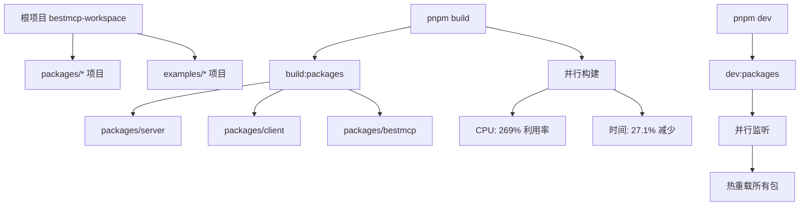

# CLAUDE.md

This file provides guidance to Claude Code (claude.ai/code) when working with code in this repository.

## 基本规则

- **重要**: 请使用中文进行所有沟通和代码注释
- 遵循项目中既有的代码风格和命名约定
- 所有新增的代码注释和文档应使用中文

## 开发命令

### 构建和开发

```bash
# 🏗️ 构建命令 (并行优化)
pnpm build              # 构建所有 packages/* (推荐日常使用)
pnpm build:packages     # 构建所有 packages/* 项目
pnpm build:examples     # 构建所有 examples/* 项目
pnpm build:all          # 构建所有项目 (packages + examples)

# 🚀 开发命令 (并行监听)
pnpm dev                # 开发模式 - 所有 packages/* (推荐日常使用)
pnpm dev:packages       # 开发模式 - 所有 packages/* 项目
pnpm dev:examples       # 开发模式 - 所有 examples/* 项目
pnpm dev:all            # 开发模式 - 所有项目 (packages + examples)

# 🧹 维护命令
pnpm clean              # 清理构建输出
pnpm type:check         # 类型检查 (不生成文件)
```

### 🔍 代码质量检查流程

**重要**: 每次代码修改后都必须执行以下检查流程，确保代码质量：

```bash
# 📋 标准质量检查流程 (按顺序执行)
nr check:fix            # 代码格式化和自动修复 (Biome)
nr type:check           # TypeScript 类型检查
nr test:silent          # 静默执行所有测试
nr spell:check          # 拼写检查
```

#### 检查流程说明

1. **`nr check:fix`** - 代码格式化
   - 使用 Biome 进行代码格式化和 linting
   - 自动修复导入排序、格式问题
   - 确保代码符合项目规范

2. **`nr type:check`** - TypeScript 类型检查
   - 执行完整的 TypeScript 编译器检查
   - 确保没有类型错误或未定义的方法/属性
   - 验证导入和类型定义正确性

3. **`nr test:silent`** - 自动化测试
   - 运行所有单元测试和集成测试
   - 确保代码修改没有破坏现有功能
   - 验证所有测试用例通过

4. **`nr spell:check`** - 拼写检查
   - 使用 cspell 检查代码中的拼写错误
   - 包括注释、变量名、文档内容
   - 确保专业性和一致性

#### 质量检查的重要性

- **防止回归**: 确保代码修改不会引入新的错误
- **保持一致性**: 统一的代码风格和质量标准
- **早期发现问题**: 在代码提交前发现潜在问题
- **团队协作**: 保证所有开发者遵循相同的质量标准

### 构建系统说明

项目使用 **tsup** 作为主要构建工具，基于 esbuild 提供极快的构建速度：

- **并行构建**：使用 pnpm workspace 过滤语法实现 packages 和 examples 的并行构建
- **性能提升**：相比传统串行构建，速度提升 30-50%，CPU 利用率提升 169%
- **核心包**：输出 ESM (`dist/index.mjs`) 和 CJS (`dist/index.js`) 两种格式
- **类型定义**：使用 tsc 单独生成 (`dist/*.d.ts`)
- **示例项目**：仅输出 CJS 格式，便于运行
- **构建时间**：通常在 100-200ms 内完成，比传统 tsc 快 10-100 倍

### 构建架构



### 推荐开发工作流

**日常开发**：
```bash
# 启动并行开发模式
pnpm dev

# 在另一个终端运行测试
pnpm test:watch
```

**全量开发**：
```bash
# 同时开发所有项目
pnpm dev:all
```

**构建验证**：
```bash
# 快速验证核心包
pnpm build

# 全面验证
pnpm build:all
```

### 测试

```bash
# 运行所有测试
pnpm test

# 静默模式运行测试
pnpm test:silent

# 生成覆盖率报告
pnpm test:coverage

# 监听模式运行测试
pnpm test:watch

# 运行特定测试文件
pnpm test packages/server/tests/server.test.ts
```

### 代码质量

```bash
# 代码格式化和修复 (使用 Biome)
pnpm check:fix

# 拼写检查
pnpm spell:check
```

## 项目架构

### 整体结构

这是一个 **monorepo** 项目，使用 pnpm workspace 管理。核心代码位于 `packages/` 目录中，包括：

- **`packages/server/`** - MCP 服务器框架核心代码，提供装饰器和传输层功能
- **`packages/client/`** - MCP 客户端库代码，提供连接和工具调用功能
- **`packages/bestmcp/`** - 主发布包，聚合 server 和 client 功能，对外提供统一 API

### 核心模块

#### 包结构关系

```
packages/bestmcp (主发布包)
├── 重新导出 packages/server 的所有功能
├── 重新导出 packages/client 的所有功能
└── 对外提供统一的 bestmcp npm 包

packages/server (服务器框架)
├── 装饰器系统 (@Tool, @Param)
├── 参数验证和 JSON Schema 转换
├── 传输层管理 (STDIO, HTTP)
└── MCP 服务器生命周期管理

packages/client (客户端库)
├── MCP 连接管理
├── 工具调用封装
└── 错误处理和重试机制
```

#### packages/server 主要文件

- **`server.ts`**: BestMCP 主类，负责服务器生命周期管理、工具注册和执行
- **`decorators.ts`**: `@Tool` 和 `@Param` 装饰器的实现，使用反射元数据存储工具信息
- **`validation.ts`**: Zod schema 验证和 JSON Schema 转换逻辑
- **`types.ts`**: 核心类型定义和接口
- **`errors.ts`**: 自定义错误类定义

#### packages/bestmcp 主文件

- **`src/index.ts`**: 主入口文件，重新导出 server 和 client 的所有公共 API
- **`package.json`**: 主发布包配置，依赖 server 和 client 作为 workspace 包

#### 传输层架构 (`transports/`)

- **`base.ts`**: 传输层基类和通用接口
- **`stdio.ts`**: 标准输入输出传输层实现
- **`http.ts`**: HTTP 传输层实现，支持 REST API 调用
- **`index.ts`**: 传输层统一导出
- **`transport-manager.ts`**: 传输层管理器，支持运行时切换传输模式

#### 关键设计模式

1. **装饰器模式**: 使用 `@Tool` 和 `@Param` 装饰器声明式定义工具
2. **反射元数据**: 通过 `reflect-metadata` 存储和获取工具参数信息
3. **策略模式**: 传输层可插拔，支持 stdio 和 HTTP 两种模式
4. **工厂模式**: 传输层管理器根据配置创建相应的传输实例

### 核心功能

#### 工具注册流程

1. 使用 `@Tool` 装饰器标记方法
2. 使用 `@Param` 装饰器定义参数验证规则
3. 通过 `mcp.register(ServiceClass)` 注册服务类
4. 框架自动提取装饰器元数据并生成 MCP 工具定义

#### 参数验证系统

- 基于 **Zod** 进行运行时类型验证
- 自动将 Zod Schema 转换为 JSON Schema
- 支持复杂类型：对象、数组、枚举、可选参数
- 智能参数映射：对象参数 ↔ 多参数调用

#### 传输层支持

- **Stdio 模式**: 传统的命令行工具集成方式
- **HTTP 模式**: REST API 接口，支持 Web 应用集成
- 运行时可切换传输层，无需重启服务

## 开发指导

### Import 规范

项目强制要求 **类型导入** 和 **值导入** 分离，以提高代码的可读性和类型安全性：

#### ✅ 正确的写法

```typescript
// 类型导入使用 import type
import type { User, Config } from "./types";
import type { ToolMetadata } from "@server/types";

// 值导入使用普通 import
import { createUser, validateUser } from "./user-service";
import { z } from "zod";
```

#### ❌ 错误的写法

```typescript
// 不允许混合导入
import { createUser, type User, type Config } from "./user-service";
import { z, type ZodSchema } from "zod";
```

#### 配置说明

- **TypeScript**: `config/tsconfig.json` 中启用了 `"verbatimModuleSyntax": true`
- **Biome**: `config/biome.json` 中配置了 `"useImportType": { "style": "separatedType" }`
- **自动修复**: 使用 `pnpm check:fix` 可以自动修复大部分导入问题
- **导入顺序**: Biome 会自动将类型导入排在值导入之前

### TypeScript 配置要求

项目启用了以下 TypeScript 特性：

- `experimentalDecorators: true` - 启用装饰器支持
- `emitDecoratorMetadata: true` - 启用装饰器元数据
- `strict: true` - 严格类型检查
- `verbatimModuleSyntax: true` - 强制类型和值导入分离

### 测试框架

- 使用 **Vitest** 作为测试框架
- 测试文件位于 `packages/server/tests/` 目录
- 测试覆盖率报告可通过 `pnpm test:coverage` 生成
- 所有测试用例应使用中文描述

### 代码质量工具

- 使用 **Biome** 进行代码格式化和 linting
- 配置文件：`config/biome.json`
- 支持自动导入排序和代码修复
- 使用 **cspell** 进行拼写检查

### 错误处理

项目定义了专门的错误类型：

- `ToolNotFoundError`: 工具未找到错误
- `ToolValidationError`: 工具参数验证错误
- `ZodValidationError`: Zod 验证错误

### 示例代码

查看 `examples/` 目录中的完整使用示例：

- `stdio-mcp/`: 基础 STDIO 服务示例
- `http-mcp/`: 基础 HTTP 服务示例
- 演示了装饰器的使用方法和不同传输层的启动方式

### API 使用模式

```typescript
// 1. 定义服务类
class MyService {
  @Tool("工具描述")
  async myMethod(
    @Param(z.string(), "参数描述") param: string
  ): Promise<string> {
    return `处理结果: ${param}`;
  }
}

// 2. 创建和配置 MCP 服务器
const mcp = new BestMCP({
  name: "my-service",
  version: "1.0.0",
});

// 3. 注册服务
mcp.register(MyService);

// 4. 启动服务器 (支持多种传输层)
await mcp.run(); // 默认 stdio 模式
await mcp.run({ transport: "http", port: 3000 }); // HTTP 模式
```

## 常见开发任务

### 添加新工具

1. 在现有服务类中添加方法
2. 使用 `@Tool` 装饰器并提供描述
3. 为每个参数使用 `@Param` 装饰器定义 Zod 验证规则
4. 编写相应的测试用例

### 扩展传输层

1. 在 `transports/` 目录创建新的传输层类
2. 继承 `BaseTransport` 并实现必要方法
3. 在 `transport-manager.ts` 中注册新的传输类型
4. 更新类型定义

### 调试工具执行

- 使用 `mcp.getToolList()` 查看已注册工具
- 使用 `mcp.validateTool(name, args)` 验证参数
- 使用 `mcp.getToolStats()` 获取统计信息
- 检查控制台输出的工具注册信息

## 🔧 常见问题排查

### TypeScript 类型错误

#### 常见错误类型

1. **方法未定义错误**
   ```
   Property 'xxx' does not exist on type 'YYY'
   ```
   **解决方案**:
   - 检查方法是否在类中正确声明
   - 确认方法名称拼写正确
   - 验证访问修饰符（public/private/protected）

2. **导入路径错误**
   ```
   Cannot find module 'xxx' or its corresponding type declarations
   ```
   **解决方案**:
   - 检查导入路径是否正确
   - 确认目标模块是否已导出
   - 运行 `pnpm install` 更新依赖

3. **类型不兼容错误**
   ```
   Type 'X' is not assignable to type 'Y'
   ```
   **解决方案**:
   - 检查类型定义是否匹配
   - 使用类型断言或类型守卫
   - 确认可选属性的处理方式

#### 类型错误修复流程

1. **运行类型检查**: `nr type:check`
2. **定位错误**: 根据错误信息和行号定位问题
3. **分析原因**: 确定是定义问题、导入问题还是使用问题
4. **实施修复**: 添加缺失的方法、修正导入或调整类型定义
5. **验证修复**: 重新运行类型检查确保问题解决

#### 典型修复示例

**添加缺失方法**:
```typescript
// 错误：Property 'initializeMCPServer' does not exist
class BestMCP {
  constructor(config: BestMCPConfig) {
    this.initializeMCPServer(config); // 方法未定义
  }

  // 修复：添加缺失的私有方法
  private initializeMCPServer(config: BestMCPConfig): void {
    this.server = new Server(
      { name: this.name, version: this.version },
      { capabilities: config.capabilities || { tools: {} } }
    );
  }
}
```

**处理可选属性**:
```typescript
// 错误：Type 'undefined' is not assignable to type 'string'
const options = {
  instructions: config.instructions, // 可能是 undefined
};

// 修复：条件性添加属性
const options: any = {
  capabilities: config.capabilities || { tools: {} },
};
if (config.instructions) {
  options.instructions = config.instructions;
}
```
