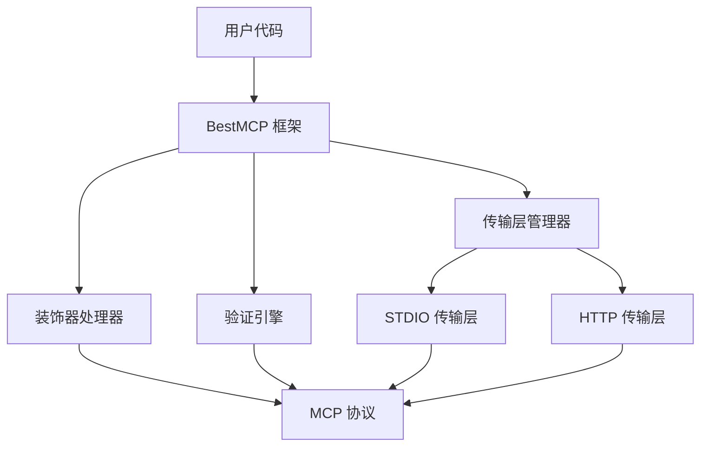

# BestMCP

BestMCP 是一个为 TypeScript 设计的 Model Context Protocol (MCP) 服务器框架，通过装饰器和 Zod 验证提供类型安全的工具声明方式。它简化了 MCP 服务器的开发流程，让开发者能够以声明式的方式定义工具和参数验证。

## ✨ 特性

- 🎯 **类型安全**：编译时类型检查和运行时验证双重保障，避免参数错误
- 🚀 **开发体验**：简洁直观的装饰器 API，大幅减少样板代码
- 🤖 **自动化**：自动生成 MCP 工具描述、JSON Schema 和错误处理
- 🔧 **扩展性**：支持复杂参数类型、异步操作和高级功能配置
- 🌐 **多传输层**：支持 STDIO 和 HTTP 两种通信方式，按需切换
- 📦 **零配置**：开箱即用，无需复杂的配置文件

## 🚀 快速开始

### 安装

```bash
npm install bestmcp zod
# 或
pnpm add bestmcp zod
```

**依赖说明**:

- `bestmcp`: 核心框架包
- `zod`: 参数验证库（peer dependency，需要手动安装）

### 第一个 MCP 服务器

创建一个简单的计算器服务：

```typescript
import { BestMCP, Param, Tool } from "bestmcp";
import { z } from "zod";

class CalculatorService {
  @Tool("计算两个数字的和")
  add(
    @Param(z.number(), "第一个值")
    a: number,
    @Param(z.number(), "第二个值")
    b: number
  ): number {
    return a + b;
  }

  @Tool("计算两个数字的积")
  multiply(
    @Param(z.number(), "第一个值")
    a: number,
    @Param(z.number(), "第二个值")
    b: number
  ): number {
    return a * b;
  }
}

// 实例化 BestMCP
const mcp = new BestMCP({
  name: "calculator-server",
  version: "1.0.0",
});

// 注册工具类
mcp.register(CalculatorService);

// 启动服务
mcp.run();
```

运行后，BestMCP 会自动：

- 解析装饰器元数据
- 生成 JSON Schema
- 注册工具到 MCP 服务器
- 处理工具调用和参数验证

## 💡 核心概念

### 装饰器声明式编程

BestMCP 使用 TypeScript 装饰器提供声明式的工具定义方式：

```typescript
class MyService {
  @Tool("工具描述")
  async myMethod(
    @Param(z.string(), "参数描述") param: string
  ): Promise<string> {
    return `处理结果: ${param}`;
  }
}
```

### 自动化 Schema 生成

BestMCP 会自动将 Zod 验证规则转换为 JSON Schema，无需手动编写：

- ✅ 类型定义和验证规则
- ✅ 参数描述和约束
- ✅ 错误处理和响应格式

## 🏗️ 架构说明

### 与 @modelcontextprotocol/sdk 的关系

BestMCP 目前基于官方 [`@modelcontextprotocol/sdk`](https://github.com/modelcontextprotocol/typescript-sdk) 构建，这帮助我们能够更快地跟进官方对 MCP 的规范定义。

**未来规划**：我们会考虑完全基于 MCP 协议规范重新实现。一旦完成，我们将不再依赖 `@modelcontextprotocol/sdk`。

### 架构设计



## 📖 使用指南

### 高级参数类型

```typescript
class UserService {
  @Tool("创建用户")
  createUser(
    @Param(
      z.object({
        name: z.string().min(1),
        age: z.number().min(0),
        email: z.string().email().optional(),
      }),
      "用户信息"
    )
    user: UserInfo
  ): Promise<User> {
    // 实现用户创建逻辑
    return createdUser;
  }
}
```

### 异步操作支持

```typescript
class ApiService {
  @Tool("获取用户信息")
  async getUser(
    @Param(z.string(), "用户ID")
    userId: string
  ): Promise<User> {
    const response = await fetch(`/api/users/${userId}`);
    return response.json();
  }
}
```

### 错误处理

```typescript
class FileService {
  @Tool("读取文件")
  readFile(
    @Param(z.string(), "文件路径")
    path: string
  ): Promise<string> {
    if (!fs.existsSync(path)) {
      throw new Error(`文件不存在: ${path}`);
    }
    return fs.readFileSync(path, "utf-8");
  }
}
```

## 🌐 传输层支持

BestMCP 支持多种 MCP 通信方式，可以根据使用场景选择合适的传输层。

### STDIO 模式

适用于命令行工具和脚本集成：

```typescript
// 默认 STDIO 模式
const mcp = new BestMCP({
  name: "my-tool",
  version: "1.0.0",
});

mcp.run();
```

**使用场景**：

- 命令行工具集成
- CI/CD 流水线
- 本地开发工具

### HTTP 模式

适用于 Web 应用和微服务架构：

```typescript
// HTTP 模式
const mcp = new BestMCP({
  name: "my-api",
  version: "1.0.0",
});

mcp.run({
  transport: "http",
  port: 3000,
});
```

**使用场景**：

- Web 应用后端
- 微服务架构
- API 服务集成

### 传输层切换

支持运行时动态切换传输层：

```typescript
const mcp = new BestMCP({
  name: "flexible-tool",
  version: "1.0.0",
});

// 根据环境变量选择传输层
const transport = process.env.HTTP_MODE ? "http" : "stdio";
const options = transport === "http" ? { port: 3000 } : {};

mcp.run({ transport, ...options });
```

## 📁 示例项目

我们在 `[examples/](./examples/)` 目录准备了一些示例，帮助你更好地理解如何使用：

- `stdio-mcp/` - STDIO 模式的完整示例
- `http-mcp/` - HTTP 模式的完整示例
- `calculator-mcp/` - 复杂计算器服务示例

每个示例都包含完整的代码和运行说明。

## 🛠️ 开发指南

### 构建和开发命令

BestMCP 使用优化的并行构建系统，支持域分离的开发模式：

```bash
# 🏗️ 构建命令
pnpm build              # 构建核心包 (推荐日常使用)
pnpm build:packages     # 构建所有 packages/* 项目
pnpm build:examples     # 构建所有 examples/* 项目
pnpm build:all          # 构建所有项目 (packages + examples)

# 🚀 开发命令 (并行监听)
pnpm dev                # 开发模式 - 核心包 (推荐日常使用)
pnpm dev:packages       # 开发模式 - 所有 packages/* 项目
pnpm dev:examples       # 开发模式 - 所有 examples/* 项目
pnpm dev:all            # 开发模式 - 所有项目 (packages + examples)

# 🧪 测试命令
pnpm test               # 运行所有测试
pnpm test:coverage      # 生成覆盖率报告
pnpm test:watch         # 监听模式运行测试

# 🔍 质量检查
pnpm type:check         # TypeScript 类型检查
pnpm check:fix          # 代码格式化和修复
pnpm spell:check        # 拼写检查

# 🧹 清理命令
pnpm clean              # 清理构建产物
```

### 推荐开发工作流

**日常开发**：
```bash
# 启动核心包开发模式
pnpm dev

# 在另一个终端运行测试
pnpm test:watch
```

**全量开发**：
```bash
# 同时开发所有项目
pnpm dev:all
```

**构建验证**：
```bash
# 构建核心包进行验证
pnpm build

# 全面构建测试
pnpm build:all
```

### 构建系统说明

项目使用 **tsup** 作为主要构建工具，基于 esbuild 提供极快的构建速度：

- **并行构建**：packages 和 examples 支持并行构建，性能提升 30-50%
- **增量构建**：支持依赖关系优化，只构建变更的模块
- **类型定义**：自动生成 `.d.ts` 文件和 source maps
- **多格式输出**：同时生成 ESM (`.mjs`) 和 CJS (`.js`) 格式

## 🤝 贡献

欢迎提交 Issue 和 Pull Request！

在贡献代码前，请确保：

1. 代码通过所有测试：`pnpm test`
2. 代码格式正确：`pnpm check:fix`
3. 拼写检查通过：`pnpm spell:check`
4. 添加适当的测试用例
5. 构建验证通过：`pnpm build`

## 📚 更多资源

- [MCP 官方文档](https://modelcontextprotocol.io/)
- [Zod 验证库文档](https://zod.dev/)
- [TypeScript 装饰器文档](https://www.typescriptlang.org/docs/handbook/decorators.html)
- [FastMCP - Python 实现](https://github.com/jlowin/fastmcp)（提供设计灵感）
