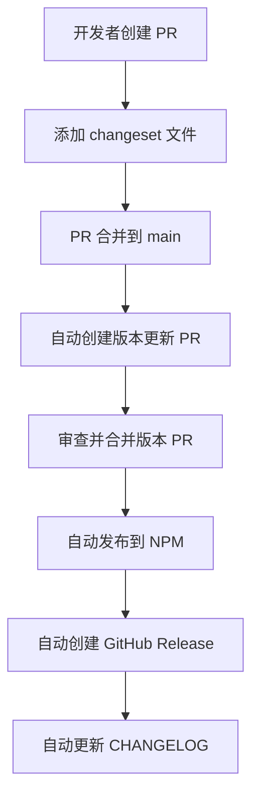

# 发布流程

本项目使用 **Changesets** 进行版本管理和发布，支持正式版本和预发布版本的自动化发布。

## 发布方式概览

### 🚀 自动化发布（基于 Changesets）

这是项目唯一的发布方式，完全自动化，支持正式版本和预发布版本（beta/rc）。

#### 工作流程



#### 详细步骤

1. **开发新功能或修复 bug**
   ```bash
   git checkout -b feature/new-feature
   # 开发代码...
   ```

2. **添加 changeset 文件**
   ```bash
   pnpm changeset
   # 按照提示选择变更类型：
   # - patch: 修复 bug (0.0.x)
   # - minor: 新功能 (0.x.0)
   # - major: 破坏性变更 (x.0.0)

   # 对于预发布版本，选择相应的发布类型：
   # - minor + release type: beta → 发布到 beta 标签
   # - minor + release type: rc → 发布到 rc 标签
   ```

3. **提交 PR**
   ```bash
   git add .
   git commit -m "feat: 添加新功能"
   git push origin feature/new-feature
   ```

4. **合并 PR 到 main 分支后**
   - GitHub Actions 会自动创建一个 "Version Packages" PR
   - 该 PR 会自动更新版本号和 CHANGELOG.md

5. **合并版本更新 PR**
   - GitHub Actions 会自动发布到 NPM
   - 自动创建 GitHub Release
   - 自动推送 Git 标签

#### 发布结果

✅ **自动完成的任务：**
- 同步更新所有包版本（bestmcp, @bestmcp/client, @bestmcp/server）
- 发布到 NPM（latest 或 beta 标签）
- 创建 GitHub Release（包含详细变更说明）
- 推送 Git 标签（v1.2.3 格式）
- 更新 CHANGELOG.md
- 构建并部署文档

---

## 🔄 预发布版本管理

项目支持 **Beta** 和 **RC** 预发布版本，用于在正式发布前进行测试和验证。

### 预发布版本类型

- **Beta 版本**: `1.2.3-beta.0`, `1.2.3-beta.1` - 用于内部测试和早期用户反馈
- **RC 版本**: `1.2.3-rc.0`, `1.2.3-rc.1` - 用于最终测试，接近正式发布

### 预发布版本发布流程

1. **创建预发布 changeset**
   ```bash
   pnpm changeset
   ```

   在交互过程中选择：
   - **版本类型**: `minor` 或 `patch`
   - **发布类型**: `beta` 或 `rc`
   - **总结变更内容**: 详细说明新功能、修复或变更

2. **提交 PR 到 main 分支**
   ```bash
   git add .
   git commit -m "feat: 添加新功能 (beta)"
   git push origin feature/new-feature
   ```

3. **自动发布过程**
   - PR 合并到 main 后，GitHub Actions 自动创建版本更新 PR
   - 合并版本更新 PR 后，自动发布到 NPM 的 `beta` 标签
   - 自动创建带预发布标识的 GitHub Release

### 预发布版本与正式版本的区别

| 特性 | 正式版本 | Beta/RC 版本 |
|------|---------|-------------|
| **NPM 标签** | `latest` | `beta` |
| **安装命令** | `npm install bestmcp` | `npm install bestmcp@beta` |
| **版本号格式** | `1.2.3` | `1.2.3-beta.0` |
| **更新提示** | 自动更新为最新版 | 需要显式指定 `@beta` |
| **受众** | 生产用户 | 测试用户、开发者 |

### 预发布版本使用场景

- **Beta 版本**:
  - 新功能开发完成后的首次发布
  - 需要社区反馈和测试
  - API 可能会根据反馈调整

- **RC 版本**:
  - 功能已稳定，准备正式发布
  - 最终测试和验证
  - 除非发现严重问题，否则与正式版基本一致

### 从预发布到正式版本

1. **创建正式版本的 changeset**
   ```bash
   pnpm changeset
   # 选择相同的变更类型，但发布类型留空（默认正式版）
   ```

2. **正常发布流程**
   - 提交 PR 到 main 分支
   - 自动发布到 `latest` 标签

---

## 📋 发布前检查清单

### 发布前必查

- [ ] 所有变更都已提交到 main 分支
- [ ] 已为重要变更添加了 changeset 文件
- [ ] 所有测试通过 (`pnpm test`)
- [ ] 构建成功 (`pnpm build:packages`)
- [ ] 代码质量检查通过 (`pnpm check:fix`)

### 预发布版本额外检查

- [ ] 版本号格式正确（如 `0.0.9-beta.0` 或 `0.0.9-rc.0`）
- [ ] changeset 文件中选择了正确的发布类型（beta/rc）
- [ ] 相关文档已更新（如果需要）
- [ ] 测试计划已完成（特别是新功能）

---

## 🚨 注意事项

### 版本号规则

- **正式版本**: `1.2.3` (使用 latest 标签)
- **Beta 版本**: `1.2.3-beta.0` (使用 beta 标签)
- **RC 版本**: `1.2.3-rc.0` (使用 beta 标签)

### Changeset 配置

项目配置了以下 Changesets 选项：

- **固定包**: `bestmcp`, `@bestmcp/server`, `@bestmcp/client` (版本同步更新)
- **变更日志**: 使用 GitHub 格式，自动关联 issue 和 PR
- **发布标签**: 根据版本号自动判断 (beta/rc → beta, 其他 → latest)

### 常见问题

**Q: 如何查看将要发布的变更？**
```bash
# 查看未发布的 changeset 文件
pnpm changeset status
# 查看版本预览
pnpm changeset version --snapshot
```

**Q: 如何发布紧急修复？**
```bash
# 创建只包含修复的 changeset
pnpm changeset
# 选择 patch 类型
# 然后按照正常流程发布
```

**Q: 如何发布预发布版本？**
```bash
# 创建 changeset 时选择发布类型
pnpm changeset
# 选择版本类型：minor/patch
# 选择发布类型：beta/rc
```

**Q: 如何安装特定版本的包？**
```bash
# 安装最新正式版
npm install bestmcp

# 安装最新的 beta 版本
npm install bestmcp@beta

# 安装特定版本
npm install bestmcp@0.0.9-beta.0
npm install bestmcp@0.0.9
```

**Q: 发布失败如何回滚？**
```bash
# NPM 包无法删除，只能发布新版本
# 如需回滚代码：
git reset --hard HEAD~1
git push origin main --force
```

**Q: 预发布版本会自动更新到正式版吗？**
不会。预发布版本（beta/rc）和正式版本是独立的发布流程：
- 预发布版本发布到 `beta` 标签
- 正式版本发布到 `latest` 标签
- 需要单独创建正式版本的 changeset 来发布正式版

---

## 🔍 验证发布

发布完成后，可以通过以下方式验证：

### 验证正式版本

1. **NPM 包状态**
   ```bash
   npm view bestmcp
   npm view @bestmcp/client
   npm view @bestmcp/server
   ```

2. **Git 标签**
   ```bash
   git tag --list "v*"
   # 查看特定版本
   git show v0.0.9
   ```

3. **GitHub Release**
   - 访问 https://github.com/shenjingnan/bestmcp/releases
   - 检查 Release 内容是否正确

4. **包安装测试**
   ```bash
   npm install bestmcp@latest
   ```

### 验证预发布版本

1. **检查 NPM 上的 beta 标签**
   ```bash
   # 查看 beta 标签的最新版本
   npm view bestmcp@beta

   # 查看特定 beta 版本信息
   npm view bestmcp@0.0.9-beta.0
   ```

2. **安装测试**
   ```bash
   # 安装最新的 beta 版本
   npm install bestmcp@beta

   # 安装特定的预发布版本
   npm install bestmcp@0.0.9-beta.0
   npm install bestmcp@0.0.9-rc.0
   ```

3. **验证预发布标识**
   ```bash
   # 检查安装的版本号
   npm list bestmcp
   # 应该显示类似：0.0.9-beta.0 或 0.0.9-rc.0
   ```

---

## 📚 相关链接

- [Changesets 官方文档](https://github.com/changesets/changesets)
- [本项目的 Changesets 配置](../.changeset/config.json)
- [GitHub Actions 自动发布工作流](../../.github/workflows/release.yml)
- [NPM 包页面（正式版）](https://www.npmjs.com/package/bestmcp)
- [NPM 包页面（Beta 版）](https://www.npmjs.com/package/bestmcp?activeTab=versions)