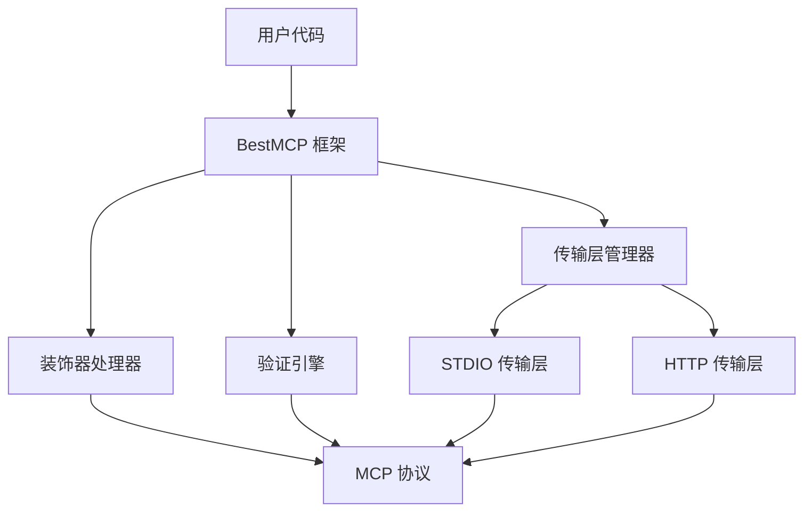

import { Callout, Tabs, Steps } from 'nextra/components'

# 介绍

BestMCP 是一个为 TypeScript 设计的 Model Context Protocol (MCP) 服务器框架，通过装饰器和 Zod 验证提供类型安全的工具声明方式。它简化了 MCP 服务器的开发流程，让开发者能够以声明式的方式定义工具和参数验证。

<Callout type="info">
  BestMCP 目前基于官方 <a href="https://github.com/modelcontextprotocol/typescript-sdk">@modelcontextprotocol/sdk</a> 构建，未来会考虑完全基于 MCP 协议规范重新实现。
</Callout>

## 核心特性

- 🎯 **类型安全**：编译时类型检查和运行时验证双重保障，避免参数错误
- 🚀 **开发体验**：简洁直观的装饰器 API，大幅减少样板代码
- 🤖 **自动化**：自动生成 MCP 工具描述、JSON Schema 和错误处理
- 🔧 **扩展性**：支持复杂参数类型、异步操作和高级功能配置
- 🌐 **多传输层**：支持 STDIO 和 HTTP 两种通信方式，按需切换
- 📦 **零配置**：开箱即用，无需复杂的配置文件

## 快速预览

### 传统 MCP 开发 vs BestMCP

<Tabs items={['传统方式', 'BestMCP']}>
  <Tabs.Tab>
    ```typescript
    // 传统方式需要手动定义工具描述
    const tools = [
      {
        name: 'calculate',
        description: '执行数学计算',
        inputSchema: {
          type: 'object',
          properties: {
            a: { type: 'number', description: '第一个数字' },
            b: { type: 'number', description: '第二个数字' },
            operation: {
              type: 'string',
              enum: ['add', 'multiply'],
              description: '运算类型'
            }
          },
          required: ['a', 'b', 'operation']
        }
      }
    ];

    // 需要手动处理工具调用和参数验证
    server.setRequestHandler('tools/call', async (request) => {
      const { name, arguments: args } = request.params;

      if (name === 'calculate') {
        // 手动验证参数
        const { a, b, operation } = args;
        if (typeof a !== 'number' || typeof b !== 'number') {
          throw new Error('参数类型错误');
        }

        // 手动处理不同运算
        if (operation === 'add') {
          return { content: [{ type: 'text', text: String(a + b) }] };
        }
        // ... 更多手动处理代码
      }
    });
    ```
  </Tabs.Tab>
  <Tabs.Tab>
    ```typescript
    import { BestMCP, Tool, Param } from 'bestmcp';
    import { z } from 'zod';

    class CalculatorService {
      @Tool("执行数学计算")
      calculate(
        @Param(z.number(), "第一个数字") a: number,
        @Param(z.number(), "第二个数字") b: number,
        @Param(z.enum(['add', 'multiply']), "运算类型") operation: 'add' | 'multiply'
      ): number {
        if (operation === 'add') return a + b;
        return a * b;
      }
    }

    const mcp = new BestMCP({
      name: "calculator-server",
      version: "1.0.0",
    });

    mcp.register(CalculatorService);
    await mcp.run();
    ```
  </Tabs.Tab>
</Tabs>

## 架构概览



## 使用场景

### 适合的应用场景

- **命令行工具增强**：为现有 CLI 工具添加 AI 能力
- **微服务集成**：在微服务架构中提供 AI 工具接口
- **开发工具扩展**：IDE 插件和开发辅助工具
- **API 网关增强**：为现有 API 添加智能处理能力
- **数据处理工具**：复杂的数据转换和分析服务

### 典型应用案例

<Callout type="default" emoji="💡">
  **示例场景**：一个代码审查工具可以使用 BestMCP 提供 AI 驱动的代码分析、优化建议和文档生成功能。
</Callout>

## 相关资源

- [MCP 官方文档](https://modelcontextprotocol.io/)
- [Zod 验证库文档](https://zod.dev/)
- [TypeScript 装饰器文档](https://www.typescriptlang.org/docs/handbook/decorators.html)
- [GitHub 仓库](https://github.com/shenjingnan/bestmcp)

<Callout type="warning" emoji="⚠️">
  **注意**：BestMCP 需要 Node.js 18+ 和 TypeScript 4.8+ 环境。确保你的开发环境满足要求。
</Callout>
