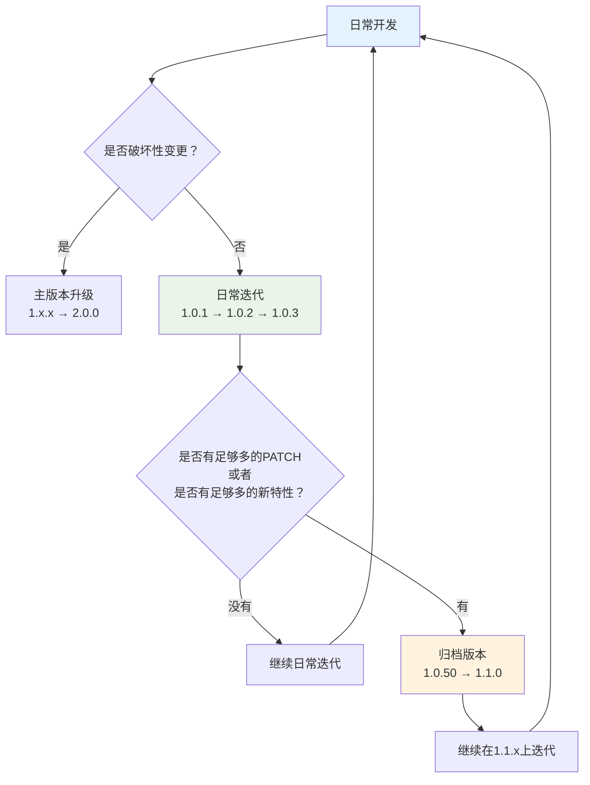
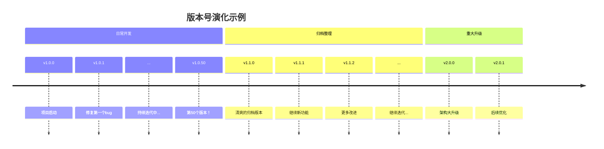

# 关于我们的发版规则

嗨！聊聊我们的版本号规则吧。

首先告诉你一个好消息：**我们的发版规则超级简单**！如果你熟悉传统的 `1.0.0` 这种版本号格式，那么你已经掌握了 90% 的内容。

## 🎯 我们的发版规则是什么？

简单来说，我们采用一种叫作 “滚动发版”（RollVer）的发版方案：

**所有新功能和 bug 修复都只升级最后一位数字！**

```
1.0.0 → 1.0.1 → 1.0.2 → 1.0.3 → ... → 1.0.50 → 1.1.0 → 1.1.1 → ... → 1.50.0 → 2.0.0
```

就这么简单！不需要争论这个功能算不算"重大特性"，不需要纠结该升哪个版本号。所有非破坏性变更，统统只升级 PATCH 版本。

## 🤔 为什么要用滚动发版？

### 我们踩过的坑

在团队开发中，传统的版本号规则经常让我们头疼：

**场景一：无休止的争论**
> "这个新功能应该算 MINOR 还是 PATCH？"
> "我觉得这个功能挺重要的，应该升 MINOR！"
> "但是上个版本才升了 MINOR，这个是不是算 PATCH？"

结果就是：团队花了大量时间在讨论版本号上，而不是写代码。

**场景二：版本号大跃进**
如果严格按照传统规则：
```
1.0.0 → 1.1.0 (加了个小功能)
→ 1.2.0 (修复了几个bug)
→ 1.3.0 (又加了个小功能)
→ 1.4.0 (优化了性能)
```
版本号跳得很快，但实际上每个版本的改动都很小。

**场景三：团队协作冲突**
两个开发者同时提交代码：
- 开发者A：提交了一个很棒的新功能，觉得应该升 MINOR
- 开发者B：同时修复了一个重要bug，觉得应该升 PATCH

结果：版本号冲突，需要人工协调。

### 我们的解决方案

既然传统规则这么麻烦，为什么不简化一下呢？

**滚动发版的核心思想：把决策简单化**

- 新功能？升级 PATCH ✅
- 修复bug？升级 PATCH ✅
- 性能优化？升级 PATCH ✅
- 文档更新？升级 PATCH ✅

**只要不破坏现有功能，统统只升最后一位数字！**

## 📊 我们的发版流程图

看了上面的文字，你可能还是有点晕。没关系，我们用一张图来清楚地展示：



**简单解释一下：**

1. **日常开发**：所有改动都只升级最后一位数字（1.0.1 → 1.0.2）
2. **归档版本**：当 PATCH 版本号达到一定数量时，我们创建一个"清爽"的版本（1.0.50 → 1.1.0）
3. **主版本升级**：当 MINOR 版本号达到一定数量时，我们创建一个"清爽"的版本（1.50.0 -> 2.0.0）

### 🎉 什么情况下会升级版本？

| 变更类型 | 版本变化 | 例子 |
|---------|---------|------|
| 修复bug | 升级PATCH | `1.0.5` → `1.0.6` |
| 新增功能 | 升级PATCH | `1.0.6` → `1.0.7` |
| 性能优化 | 升级PATCH | `1.0.7` → `1.0.8` |
| 归档PATCH版本 | 升级MINOR | `1.0.50` → `1.1.0` |
| 归档MINOR版本 | 升级MAJOR | `1.50.0` → `2.0.0` |

从这里你可以看出，`1.1.0` 只是对 `1.0.50` 的归档，他们是完全相等的。 

`2.0.0` 只是 `1.50.0` 的归档，他们是完全相等的。

而 `1.0.1` → `1.0.50` 或者 `1.1.0` → `1.50.0` 又是保证完全向下兼容的。

因此你可以放心的升级版本，不用担心破坏性变更。

当你需要跨越一个 MINOR 或者 MAJOR 版本时，我们提供了你一个台阶(归档版本)，帮助你升级。

踩上新台阶后，你可以继续无压力的升级新的 PATCH 版本。

## 📈 版本演化时间线

让我们看看一个完整的项目周期中版本号是如何变化的：



从时间线可以看出，**90% 的时间里，我们只需要关注最后一位数字的变化**！

## 💡 用户不用担心的问题

看完上面的介绍，你可能会担心：
- "这种发版规则会不会影响我使用？"
- "版本号会不会变得很奇怪？"
- "我能理解什么时候该升级吗？"

**请放心！** 我们的滚动发版实际上和你熟悉的传统版本号**完全兼容**：

### ✅ 对用户来说，一切照旧
- 你仍然可以像往常一样使用 `npm install package@^1.0.0`
- 版本比较规则完全一样，`1.0.10` > `1.0.9`
- 升级提示和依赖解析机制都没有变化
- 你看到的功能变化和版本号增长是成正比的

### ✅ 更丝滑的升级体验
- **不会突然跳版本**：版本号增长更加平滑
- **功能累积明显**：看到 `1.0.50` 就知道有很多功能改进
- **归档版本清爽**：`1.1.0` 给你一个整理好的"稳定点"

### ✅ 开发团队更高效
这意味着：
- 更快的功能发布节奏
- 更少因为版本号争论耽误的开发时间
- 更专注于功能质量而不是版本号规则

## 🎉 总结

我们的滚动发版规则很简单：

**所有非破坏性变更都只升级 PATCH 版本，偶尔整理成归档版本，真正破坏性变更才升级主版本。**

这样既保持了传统版本号的直观性，又简化了团队的发版决策。最终目的就是：**让开发者专注于写代码，让用户享受持续的功能改进！**

就这么简单，不用过度担心版本号的问题啦～ 🚀
